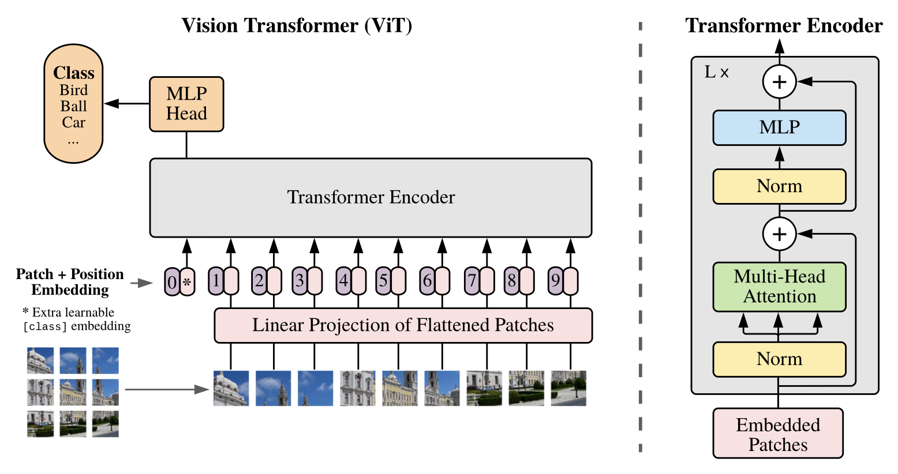

# ViT-PyTorch
Understanding Vision Transformer by implementation using PyTorch.

|  |
|:--------------------------------:|

### [paper_replication](./paper_replication.ipynb):
* Replicating Vision Transformer (ViT) Research Paper using PyTorch.
* Fine-tuning pretrained ViT on custom dataset.

### [scratch_ViT](./scratch_ViT.ipynb):
* Building Vision Transformer from scratch and training on MNIST dataset.